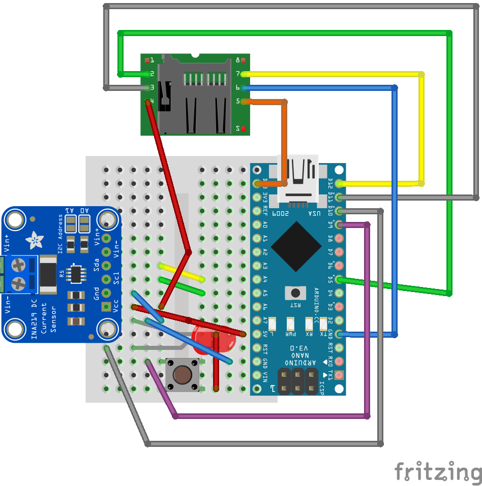
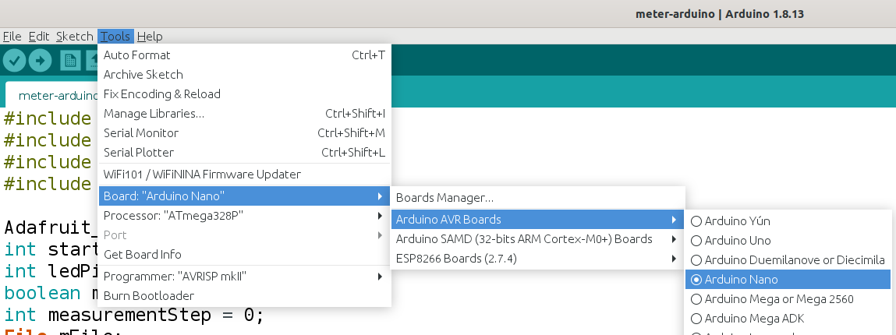
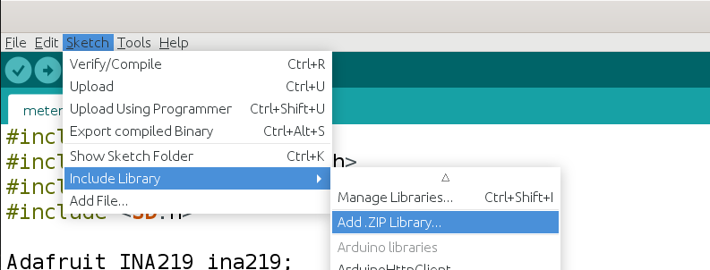
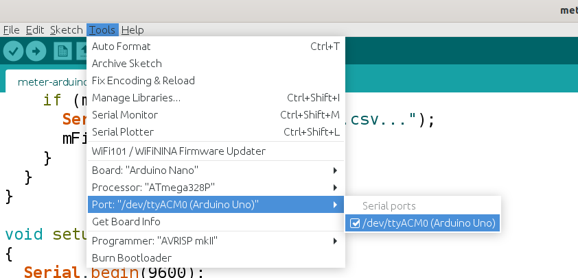
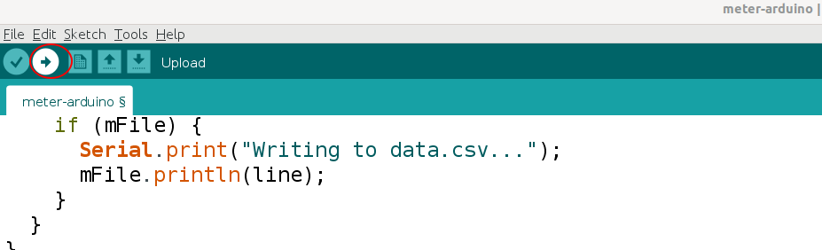

# Arduino Current Meter

This is the electronic circuit of the current meter prototype:

To build it you will need the following components:
- 1 Arduino Nano;
- 1 Adafruit INA219 current sensor;
- 1 microSD card adapter;
- 1 SD card;
- 1 170 points breadboard;
- 1 push button;
- 1 red LED;
- male-male 10cm jumpers;
- male-female 10cm jumpers;
- female-female 10cm jumpers.

## Programming

First of all, you must download the Arduino IDE from [here](https://www.arduino.cc/en/software). Then, follow the steps bellow.

### 1) Setting Up the Arduino Nano as Board

### 2) Configuring the Libraries

Our current meter device requires two libraries (download each GitHub repository as a Zip file):

- [Adafruit INA219 Sensor](https://github.com/adafruit/Adafruit_INA219)

- [Adafruit BusIO](https://github.com/adafruit/Adafruit_BusIO)

Here is how we install them in the IDE (you just need to upload the Zip files):

### 3) Configuring the Communication Port

For that, it is required that your Arduino Nano is connected to a USB port. 

### 4) Uploading the Code

Supposing that you have already opened the <i>.ino</i> file in this folder and you followed all the previous steps, you should be able to upload the code to the Arduino Nano.

To check whether the code is working, just push the button in your circuit, so the LED should be lit.

In case you have throubles in Linux, follow [this](https://forum.arduino.cc/t/permission-denied-on-dev-ttyacm0/475568).
